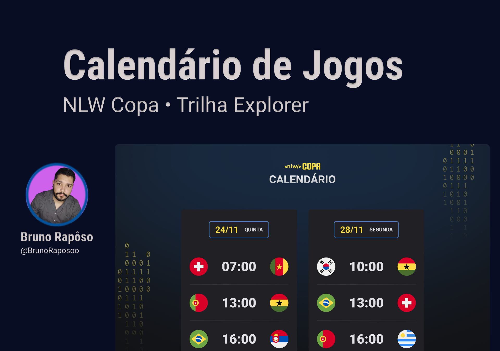

<h1 align="center"> NLW Copa </h1>  

Evento promovido pela rocketseat para ensino de tecnologia e desenvolvimento web.

    <a href="#-tecnologias">Tecnologias</a>&nbsp;&nbsp;&nbsp;|&nbsp;&nbsp;&nbsp;
    <a href="#-projeto">Projeto</a>&nbsp;&nbsp;&nbsp;|&nbsp;&nbsp;&nbsp;
    <a href="#-layout">Layout</a>&nbsp;&nbsp;&nbsp;|&nbsp;&nbsp;&nbsp;
    <a href="#memo-licença">Licença</a>

    

 

    

## Tecnologias

Projeto desenvolvido com as tecnologias:

- HMTL e CSS
- JavaScript
- Git e Github

## Projeto

Mostrar o calendário de jogos do grupo do Brasil durante a copa do mundo de futebol de 2022

Para conferir o projeto [clique aqui](https://nlw-copa-explorer-sandy.vercel.app/).

## Layout

O layout do projeto pode ser consultado através [DESSE LINK](https://www.figma.com/file/tGYUdji1JTDsH6tttFLuW9/Calend%C3%A1rio-de-Jogos-(Community)?node-id=0%3A1&t=KJa8AvWP7usgjolw-0). É necessário ter uma conta no [figma](https://www.figma.com/) para acessá-lo.

## Licença

Esse projeto está sob a licença MIT.